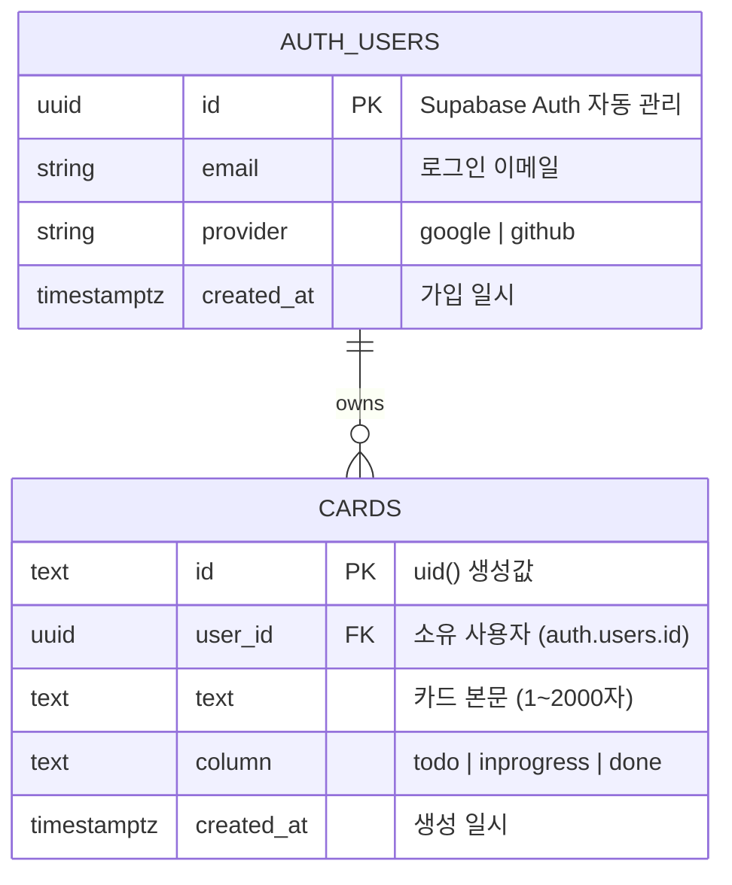
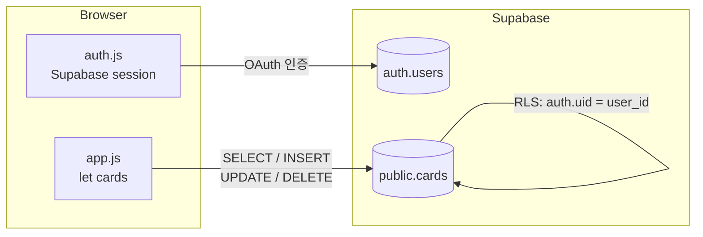

# Database Design — 데이터베이스 설계

> v2.0부터 **Supabase Database(PostgreSQL)**를 영속 저장소로 사용한다.  
> Supabase Auth가 `auth.users`를 자동 관리하며, `public.cards`는 `user_id`로 사용자를 격리한다.

---

## ERD (Mermaid)



---

## Supabase SQL DDL

```sql
-- auth.users는 Supabase Auth가 자동 생성·관리 (직접 CREATE 불필요)

CREATE TABLE public.cards (
  id         TEXT PRIMARY KEY,
  user_id    UUID NOT NULL
             REFERENCES auth.users(id)
             ON DELETE CASCADE,
  text       TEXT NOT NULL
             CHECK(length(text) BETWEEN 1 AND 2000),
  "column"   TEXT NOT NULL
             CHECK("column" IN ('todo', 'inprogress', 'done')),
  created_at TIMESTAMPTZ DEFAULT now()
);

-- RLS 활성화
ALTER TABLE public.cards ENABLE ROW LEVEL SECURITY;

-- 본인 카드만 조회·생성·수정·삭제 가능
CREATE POLICY "own cards" ON public.cards
  USING  (auth.uid() = user_id)
  WITH CHECK (auth.uid() = user_id);
```

> Supabase Dashboard → SQL Editor에서 위 DDL을 실행한다.

---

## CRUD API (Supabase JS SDK)

### 조회 (loadCards)

```js
const { data, error } = await supabaseClient
  .from('cards')
  .select('id, text, column')
  .order('created_at');
```

### 추가 (addCard)

```js
const { error } = await supabaseClient
  .from('cards')
  .insert({ id: uid(), text, column, user_id: user.id });
```

### 컬럼 이동 (moveCard)

```js
const { error } = await supabaseClient
  .from('cards')
  .update({ column: targetColumn })
  .eq('id', id);
```

### 삭제 (deleteCard)

```js
const { error } = await supabaseClient
  .from('cards')
  .delete()
  .eq('id', id);
```

> RLS가 활성화되어 있으므로 `user_id` 조건 없이도 타 사용자 데이터에 접근 불가.

---

## 데이터 흐름 다이어그램



---

## v1.0 → v2.0 마이그레이션

| 항목 | v1.0 | v2.0 |
|---|---|---|
| 저장소 | `localStorage('kanban-cards')` | Supabase `public.cards` |
| 인증 | 없음 | Supabase Auth (Google/GitHub) |
| 데이터 격리 | 없음 (단일 기기) | RLS (`user_id`) |
| 기기 동기화 | 불가 | 가능 |

> v1.0 localStorage 데이터는 자동 마이그레이션 되지 않는다.  
> 신규 로그인 후 카드를 다시 입력하거나, 향후 마이그레이션 스크립트를 별도 작성한다.
