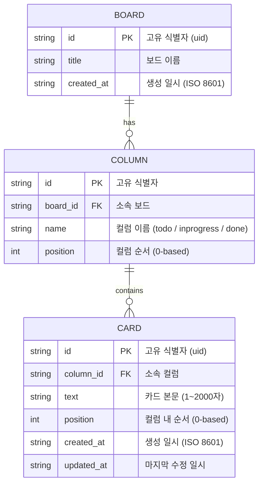
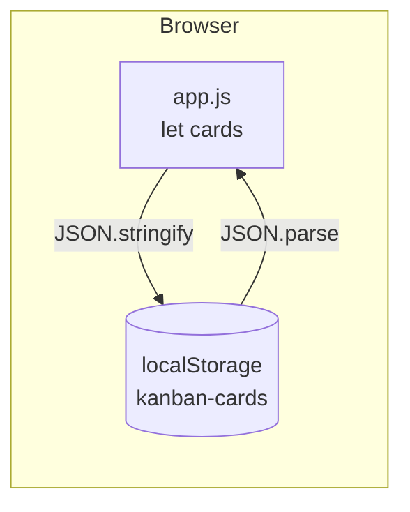

# Database Design — 데이터베이스 설계

> 현재 버전은 서버 DB 없이 **브라우저 localStorage**를 영속 저장소로 사용한다.  
> 아래 ERD는 논리 데이터 모델이며, 향후 백엔드 DB(예: SQLite, PostgreSQL) 전환 시 그대로 적용할 수 있다.

---

## ERD (Mermaid)



---

## 현재 구현 (localStorage) 스키마

MVP에서는 Board·Column 개념 없이 카드 배열만 저장한다.

```
localStorage key : "kanban-cards"
value            : JSON 배열 (Card[])
```

### Card 객체 (현재)

| 필드 | 타입 | 제약 | 설명 |
|---|---|---|---|
| `id` | string | PK, 필수 | `Date.now().toString(36) + random` |
| `text` | string | 필수, trim 후 비어있으면 저장 안 함 | 카드 본문 |
| `column` | enum | 필수 | `'todo'`, `'inprogress'`, `'done'` 중 하나 |

### 예시 JSON

```json
[
  { "id": "lxq8f3ab2", "text": "디자인 시안 검토", "column": "todo" },
  { "id": "lxq8f3kc1", "text": "백엔드 API 연동",  "column": "inprogress" },
  { "id": "lxq8f3zy9", "text": "유닛 테스트 작성", "column": "done" }
]
```

---

## 확장 데이터 모델 (향후 백엔드 전환 시)

### 논리 → 물리 매핑 (SQLite 예시)

```sql
CREATE TABLE boards (
    id         TEXT PRIMARY KEY,
    title      TEXT NOT NULL DEFAULT '내 보드',
    created_at TEXT NOT NULL DEFAULT (datetime('now'))
);

CREATE TABLE columns (
    id       TEXT PRIMARY KEY,
    board_id TEXT NOT NULL REFERENCES boards(id) ON DELETE CASCADE,
    name     TEXT NOT NULL,
    position INTEGER NOT NULL DEFAULT 0
);

CREATE TABLE cards (
    id         TEXT PRIMARY KEY,
    column_id  TEXT NOT NULL REFERENCES columns(id) ON DELETE CASCADE,
    text       TEXT NOT NULL CHECK(length(text) BETWEEN 1 AND 2000),
    position   INTEGER NOT NULL DEFAULT 0,
    created_at TEXT NOT NULL DEFAULT (datetime('now')),
    updated_at TEXT NOT NULL DEFAULT (datetime('now'))
);
```

---

## 데이터 흐름 다이어그램


