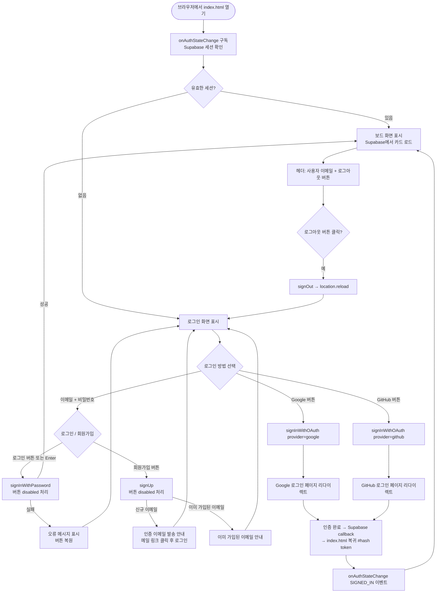
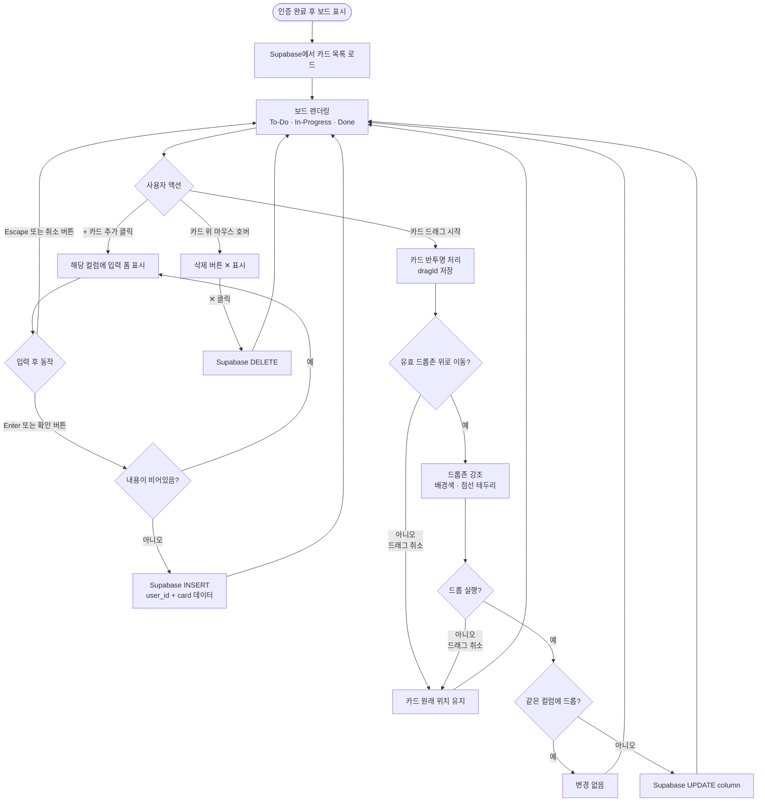
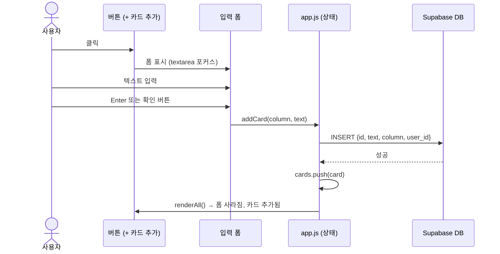
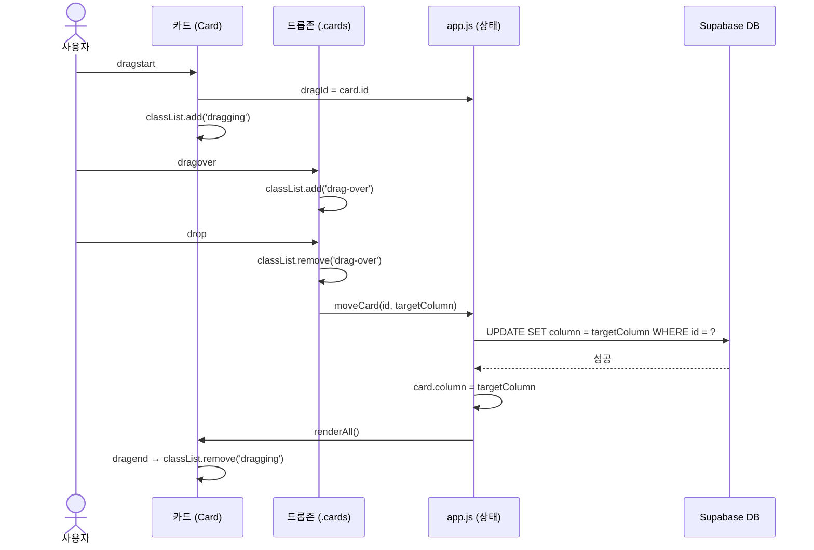

# UserFlow — 사용자 흐름도

## 인증 흐름 (v2.1)

```mermaid
flowchart TD
    A([브라우저에서 index.html 열기]) --> B[onAuthStateChange 구독\nSupabase 세션 확인]
    B --> C{유효한 세션?}

    C -- 있음 --> D[보드 화면 표시\nSupabase에서 카드 로드]
    C -- 없음 --> E[로그인 화면 표시]

    E --> F{로그인 방법 선택}

    F -- 이메일 + 비밀번호 --> G{로그인 / 회원가입}
    G -- 로그인 버튼 또는 Enter --> H[signInWithPassword\n버튼 disabled 처리]
    H -- 성공 --> D
    H -- 실패 --> I[오류 메시지 표시\n버튼 복원]
    I --> E

    G -- 회원가입 버튼 --> J[signUp\n버튼 disabled 처리]
    J -- 신규 이메일 --> K[인증 이메일 발송 안내\n메일 링크 클릭 후 로그인]
    J -- 이미 가입된 이메일 --> L[이미 가입된 이메일 안내]
    K --> E
    L --> E

    F -- Google 버튼 --> M[signInWithOAuth provider=google]
    F -- GitHub 버튼 --> N[signInWithOAuth provider=github]

    M --> O[Google 로그인 페이지 리다이렉트]
    N --> P[GitHub 로그인 페이지 리다이렉트]

    O --> Q[인증 완료 → Supabase callback\n→ index.html 복귀 #hash token]
    P --> Q

    Q --> R[onAuthStateChange SIGNED_IN 이벤트]
    R --> D

    D --> S[헤더: 사용자 이메일 + 로그아웃 버튼]
    S --> T{로그아웃 버튼 클릭?}
    T -- 예 --> U[signOut → location.reload]
    U --> E
```

---

## 보드 전체 흐름 (v2.1)

```mermaid
flowchart TD
    A([인증 완료 후 보드 표시]) --> B[Supabase에서 카드 목록 로드]
    B --> E[보드 렌더링\nTo-Do · In-Progress · Done]

    E --> F{사용자 액션}

    %% 카드 추가 흐름
    F -- "+ 카드 추가" 클릭 --> G[해당 컬럼에 입력 폼 표시]
    G --> H{입력 후 동작}
    H -- Enter 또는 확인 버튼 --> I{내용이 비어있음?}
    I -- 아니오 --> J[Supabase INSERT\nuser_id + card 데이터]
    I -- 예 --> G
    J --> E
    H -- Escape 또는 취소 버튼 --> E

    %% 카드 삭제 흐름
    F -- 카드 위 마우스 호버 --> K[삭제 버튼 ✕ 표시]
    K -- ✕ 클릭 --> L[Supabase DELETE]
    L --> E

    %% 드래그 앤 드롭 흐름
    F -- 카드 드래그 시작 --> M[카드 반투명 처리\ndragId 저장]
    M --> N{유효 드롭존 위로 이동?}
    N -- 예 --> O[드롭존 강조\n배경색 · 점선 테두리]
    N -- 아니오\n드래그 취소 --> P[카드 원래 위치 유지]
    P --> E
    O --> Q{드롭 실행?}
    Q -- 예 --> R{같은 컬럼에 드롭?}
    R -- 예 --> S[변경 없음]
    R -- 아니오 --> T[Supabase UPDATE column]
    S --> E
    T --> E
    Q -- 아니오\n드래그 취소 --> P
```

---

## 카드 추가 상세 흐름

```mermaid
sequenceDiagram
    actor U as 사용자
    participant B as 버튼 (+ 카드 추가)
    participant F as 입력 폼
    participant S as app.js (상태)
    participant DB as Supabase DB

    U->>B: 클릭
    B->>F: 폼 표시 (textarea 포커스)
    U->>F: 텍스트 입력
    U->>F: Enter 또는 확인 버튼
    F->>S: addCard(column, text)
    S->>DB: INSERT {id, text, column, user_id}
    DB-->>S: 성공
    S->>S: cards.push(card)
    S->>B: renderAll() → 폼 사라짐, 카드 추가됨
```

---

## 드래그 앤 드롭 상세 흐름

```mermaid
sequenceDiagram
    actor U as 사용자
    participant C as 카드 (Card)
    participant Z as 드롭존 (.cards)
    participant S as app.js (상태)
    participant DB as Supabase DB

    U->>C: dragstart
    C->>S: dragId = card.id
    C->>C: classList.add('dragging')

    U->>Z: dragover
    Z->>Z: classList.add('drag-over')

    U->>Z: drop
    Z->>Z: classList.remove('drag-over')
    Z->>S: moveCard(id, targetColumn)
    S->>DB: UPDATE SET column = targetColumn WHERE id = ?
    DB-->>S: 성공
    S->>S: card.column = targetColumn
    S->>C: renderAll()

    C->>C: dragend → classList.remove('dragging')
```
